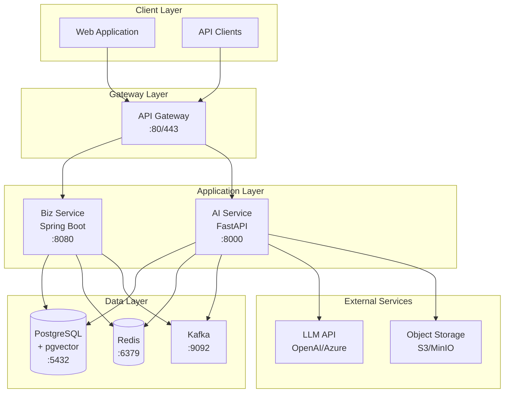
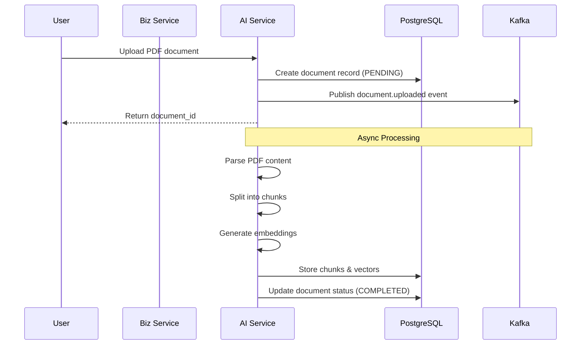
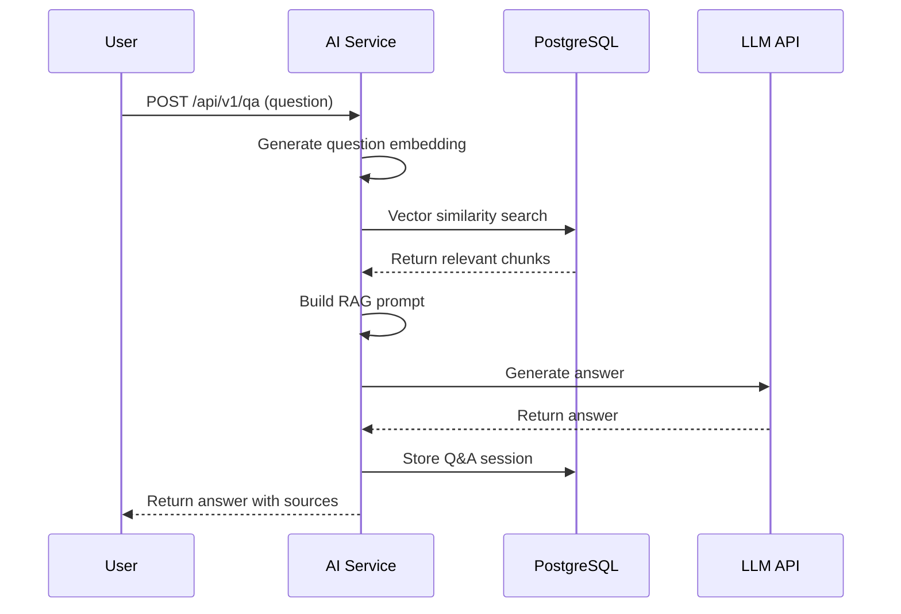
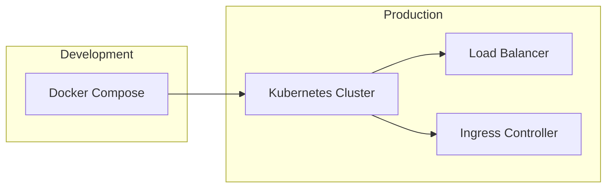

# EKP System Architecture

## Overview

Enterprise Knowledge Platform (EKP) is a RAG-based intelligent Q&A system designed for enterprise knowledge management.

## System Architecture Diagram

## Component Details

### 1. ekp-biz-service (Business Service)

**Technology Stack:**
- Java 21
- Spring Boot 3.2
- Spring Data JPA
- Flyway (Database Migration)

**Responsibilities:**
- User authentication and authorization
- Document metadata management
- Q&A session management
- Business logic orchestration

**API Endpoints:**
- `GET /health` - Health check
- `POST /api/v1/users` - User management
- `GET /api/v1/documents` - Document listing
- `GET /api/v1/qa/sessions` - Q&A history

### 2. ekp-ai-service (AI Service)

**Technology Stack:**
- Python 3.11
- FastAPI
- LangChain
- Sentence Transformers
- pgvector

**Responsibilities:**
- Document processing (PDF parsing, chunking)
- Text embedding generation
- Vector storage and retrieval
- RAG-based question answering

**API Endpoints:**
- `GET /health` - Health check
- `POST /api/v1/documents` - Document upload
- `POST /api/v1/qa` - Question answering
- `GET /api/v1/qa/{session_id}` - Q&A session details

### 3. ekp-infra (Infrastructure)

**Components:**
- Docker Compose configuration
- PostgreSQL with pgvector extension
- Redis for caching
- Kafka for async messaging

## Data Flow

### Document Upload Flow

### Question Answering Flow

## Technology Decisions

| Component | Technology | Rationale |
|-----------|------------|-----------|
| AI Service | Python/FastAPI | Rich ML ecosystem, async support |
| Biz Service | Java/Spring Boot | Enterprise-grade, strong typing |
| Database | PostgreSQL + pgvector | ACID compliance, native vector support |
| Cache | Redis | High performance, versatile data structures |
| Message Queue | Kafka | High throughput, durability |
| Embedding | BAAI/bge-large-zh | Chinese language support, high quality |

## Deployment Architecture

## Security Considerations

1. **Authentication**: JWT-based authentication
2. **Authorization**: Role-based access control (RBAC)
3. **Data Encryption**: TLS for transit, encryption at rest
4. **API Security**: Rate limiting, input validation

## Performance Targets

| Metric | Target |
|--------|--------|
| Q&A Latency | < 2 seconds |
| Concurrent Users | 5+ users |
| Document Processing | < 30 seconds per document |
| Vector Search | < 100ms |
